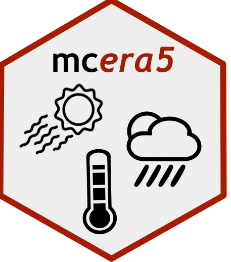

# mcera5 

A package to download and process ERA5 data ready for use in microclimate modelling. Corresponding paper describing version 1.0 of the package [here in _Methods in Ecology and Evolution_](https://doi.org/10.1111/2041-210X.13877).

## Install

You can install the package from this GitHub repository via the follow line:  
`remotes::install_github("dklinges9/mcera5")`

## Tutorial

The vignette can then be accessed via:   
`vignette("mcera5_vignette")`  

Alternatively you can navigate to the vignette manually [here](https://github.com/dklinges9/mcera5/blob/master/vignettes/mcera5_vignette.Rmd) on the GitHub repository.  

## Setup

ERA5 climate data can be downloaded from the ECMWF climate data store (CDS). Note that in July 2024 the CDS migrated to a new platform, and the old platform was deprecated in Sept 2024. The following describes how to access the data using R:

1) Register for an ECMWF account [here](https://accounts.ecmwf.int/auth/realms/ecmwf/login-actions/registration?client_id=cms-www&tab_id=yu4FgUR5-ds). Upon registering you will need to accept all of the Terms and Conditions listed at the bottom of the form.

2) Then, navigate to the CDS site [here](https://cds.climate.copernicus.eu/) and login using the button in the top right. Once logged in, hover your mouse over your name in the top right, and click on the option "Your profile" that appears (this should bring you to [this page](https://cds.climate.copernicus.eu/profile). Here you will 
find your User ID (UID) and Personal Access Token, both which are required for you to remotely download data from the CDS. Make a note of these.  

3) Each CDS dataset has its own unique Terms of Use. You will need to accept these Terms for ERA5-reanalysis at [this page](https://cds.climate.copernicus.eu/datasets/reanalysis-era5-single-levels?tab=download) (scroll down to "Terms of use" and accept). This same set of terms also applies for other Copernicus products, including ERA5-land.

## News

_31 May 2025_: the aforementioend ERA5 time-series can now be queried via a new (and not fully tested) function, `build_era5_timeseries_request.R`. NOTE: ERA5 time-series currently does not include all variables necessary
#' for microclimate modeling, only the following variables can be queried: 2m_temperature, 2m_dewpoint_temperature, surface_pressure, 10m_u_component_of_wind, 10m_v_component_of_wind, total_precipitation.

_21 March 2025_: this week, ECMWF announced a new [time series ERA5 archive](https://forum.ecmwf.int/t/new-dataset-published-in-cds-era5-hourly-time-series-data-on-single-levels-from-1940-to-present/11919), and the [ERA-Explorer](https://era-explorer.climate.copernicus.eu/) for visualizing ERA5 data. This new time series ERA5 archive is "for retrieving long time-series for a single point in a efficient way", which may be useful for more efficient `mcera5` queries. Accessing this new archive is on my radar and I hope for it to be a feature soon!

_7 Jan 2025_: CDS has now changed the URL for the API from their temporary URL to their permanent URL, which may require an update to your .cdsapirc file in your home directory. See [here](https://cds.climate.copernicus.eu/how-to-api) for the updated URL. As of today, https://cds.climate.copernicus.eu/api is the new URL.  

_8 Oct 2024_: modularity to handle ERA5-reanalysis and ERA5-land files downloaded from BOTH the old (legacy) CDS and the new (beta) CDS has been provided in `mcera5`. In addition, users must specify if they want extracted climate data to be formatted for a specific microclimate R package: `microclima`, `NicheMapR`, `microclimc`, `microclimf`, or `micropoint` (`microclimc` is the default). The branch "new_cds_time_edits" has been merged into master and will soon be deleted.

_25 Sept 2024_: ERA5-reanalysis and ERA5-land files downloaded from the beta CDS have a different structure to their time dimension. To extract climate data from these files (e.g. using `extract_clim()`), please see the developer branch "new_cds_time_edits". You can install this branch directly via:

`remotes::install_github("dklinges9/mcera5", ref = "new_cds_time_edits")`

_Sept 2024_: This package is going through a lot of development to keep up with changes as ECMWF migrates to the new [Climate Data Store](https://cds.climate.copernicus.eu/). These changes include lower API limits, different variable names/netCDF file structures, and different credentials (see below for details). If you are facing unexplainable errors, please bring them to my attention (see Questions, Concerns, Issues below). You can see live usage of the new CDS [at this interface](https://cds.climate.copernicus.eu/live).  

## Questions, Concerns, Issues

**Before emailing about a concern**, please submit a reproducible example as an issue on this Github repository. To do so, navigate to [the main page of this repository](https://github.com/dklinges9/mcera5/) and click on the "Issues" tab, and then "New Issue." Provide details of the problem you are facing, *provide code and data files that allow me to reproduce your problem*, and specify what version of `mcera5` you have installed (if you do not have the latest installation, I recommend updating the package first before reaching out, or explaining why you have a prior version). Submitting issues is the preferred method of requesting help as this provides a public record for others to view and learn from. If you do not have a GitHub account or are otherwise unable to submit an issue, then contact David Klinges at dklinges9@gmail.com. Please note that I receive many requests via email that can be solved by updating the package! I am also a researcher (probably like you) and may not always be able to reply to your emails promptly. Thank you for your patience and interest in using the package!

## Using and citing the package

If you use this package for your research, please cite the corresponding paper:

Klinges, D. H., Duffy, J. P., Kearney, M. R., & Maclean, I. M. D. (2022). mcera5: Driving microclimate models with ERA5 global gridded climate data. Methods in Ecology and Evolution, 13(7), 1402–1411. https://doi.org/10.1111/2041-210X.13877

I am a researcher (probably like you) and developing and maintaining such software doesn't come with credit, so citing the paper is appreciated! Also if you use and like this package, please consider Starring it: on [the main page of this repository](https://github.com/dklinges9/mcera5/), in the top right click on "Star".

## Contact and Contributors

David Klinges: _Maintainer, primary contact_  
James Duffy: _Creator_  
Ilya Maclean: _Contributor_  
